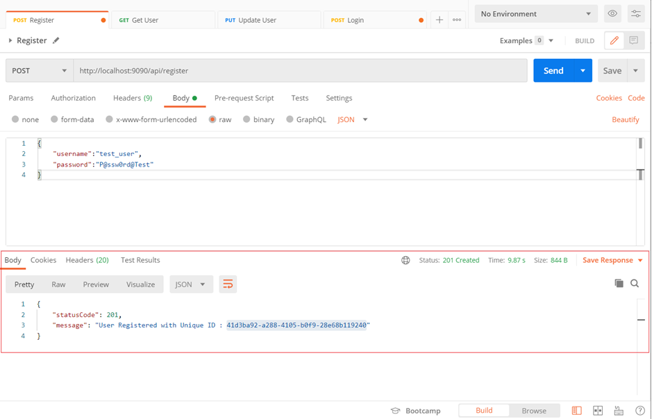
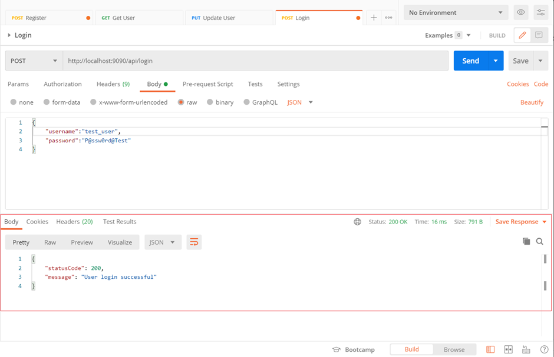
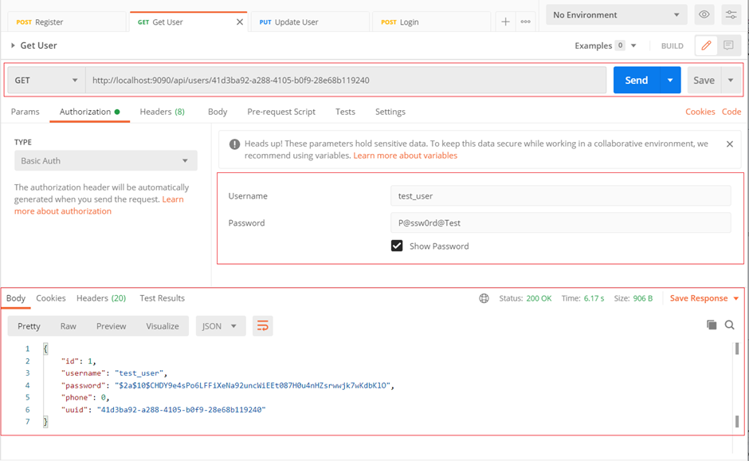
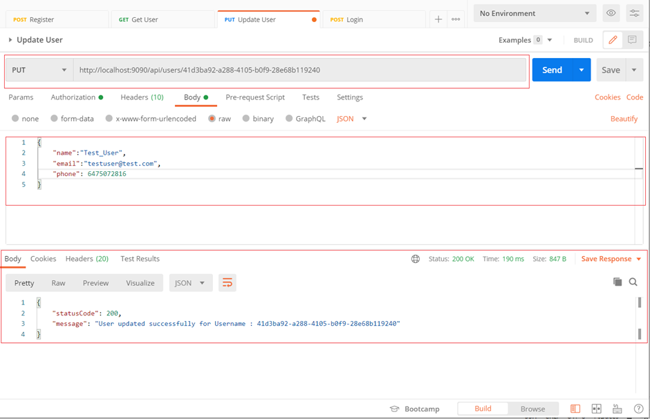
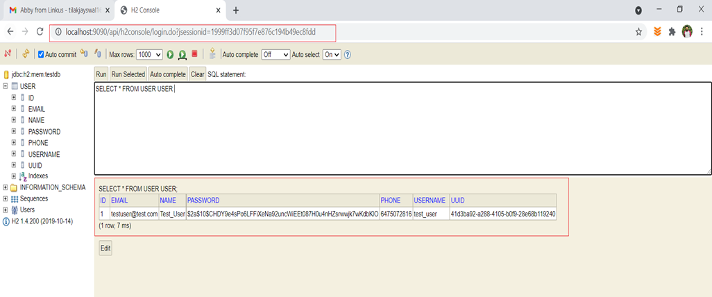

**UserManagement**

**Technological stack**

- Spring Boot
- Spring Security- Basic Authentication
- Spring JPA
- Java 8
- JUnit
- Mockito
- H2 Database (Can be accessed at : http://localhost:9090/api/h2console/)

**Endpoints**

**1. Endpoint for user to 'create' an account**

`POST /api/register
{
username,
password
}`

**2. Endpoint for user to log in**

`POST /api/login
{
username,
password
}`

**3. Secure endpoint for user to get their personal information**

`GET /api/users/{uuid}
`

**4. Secure endpoint for user to update their personal information**

   
`POST /api/users/{uuid}
`   
`{
   name,
   email,
   phone
}`

`

**Data Verification in H2**

